# Project: Cryptographic File Encryption Analysis with OpenSSL

## Overview
This project demonstrates practical implementation of various cryptographic algorithms using OpenSSL to encrypt and decrypt sensitive files. The analysis includes AES-256-CBC, RC2, and Blowfish ciphers with performance comparisons, security assessments, and practical encryption/decryption operations.

---

## Organizational Application

### Importance to Companies
This cryptographic implementation is essential for protecting sensitive organizational data at rest and in transit. It provides a practical framework for enforcing data confidentiality, ensuring regulatory compliance, and preventing unauthorized access to critical information assets.

### Use Case Scenario
A legal firm uses AES-256 encryption to protect client case files stored on shared drives, ensuring that only authorized personnel with the passphrase can access sensitive litigation documents, thus maintaining attorney-client privilege.

---

## Configuration & Screenshots

### 1. Text File Creation and Content Display
- Created plaintext file containing quantum computing security analysis
- Used nano editor for file creation and editing
- Displayed original content using cat command

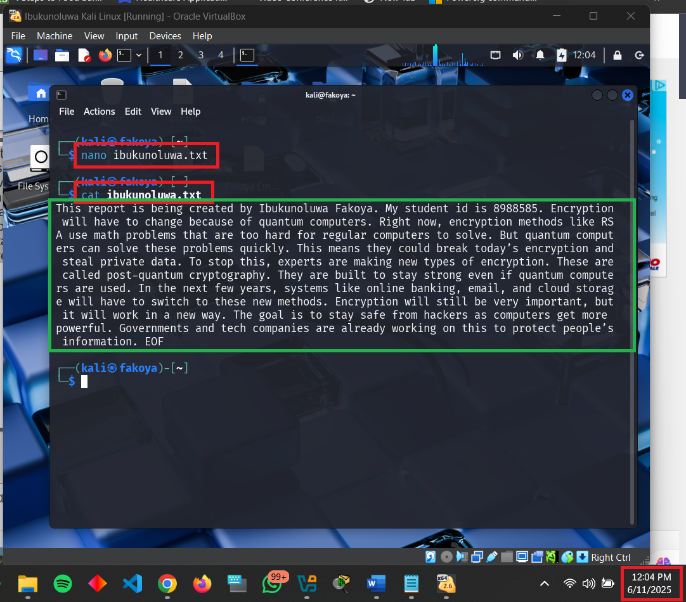
*Plaintext file creation and content display showing quantum computing security report*

### 2. AES-256-CBC Encryption Process
- Switched to root user for administrative privileges
- Encrypted file using AES-256-CBC algorithm without Base64 encoding
- Generated binary encrypted output file

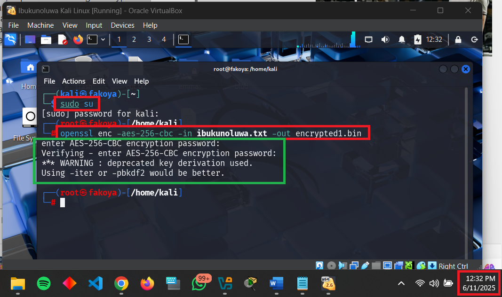
*AES-256-CBC encryption process showing password entry and key derivation warning*

### 3. Binary Encrypted Output Examination
- Displayed binary encrypted content using cat command
- Demonstrated unreadable binary format of encrypted data
- Showed practical output of non-Base64 encrypted files

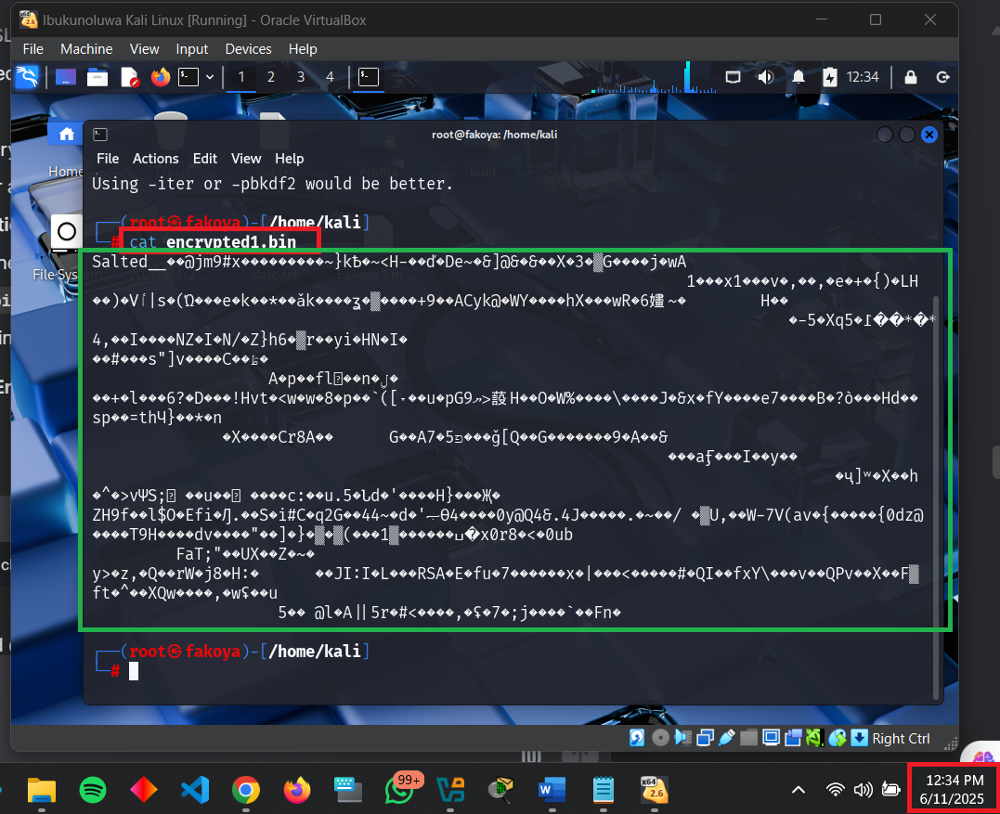
*Binary encrypted file content showing non-human-readable format*

### 4. AES-256-CBC with Base64 Encoding
- Repeated encryption with Base64 encoding for text-based output
- Generated ASCII-readable encrypted content
- Maintained same cryptographic strength with different encoding

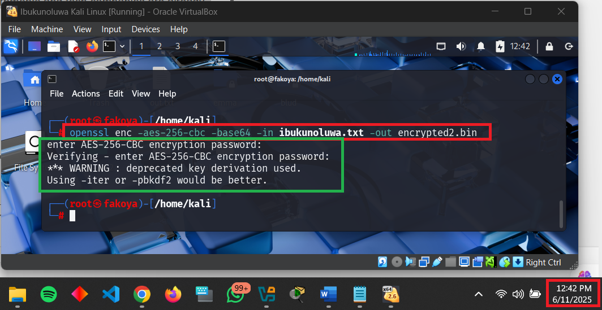
*AES-256-CBC encryption with Base64 encoding showing text-based output*

### 5. Base64 Encrypted Output Examination
- Displayed Base64-encoded encrypted content
- Showed human-readable but securely encrypted format
- Demonstrated practical application for text-based systems

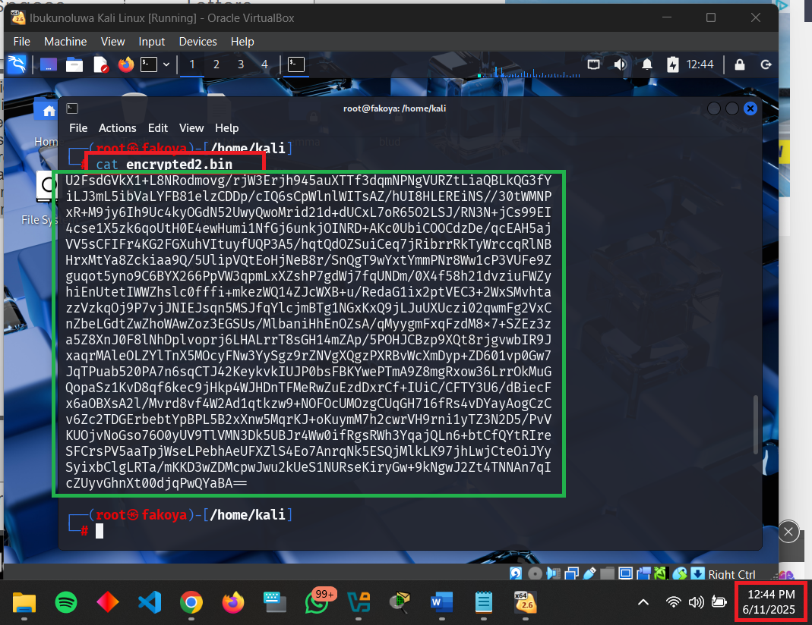
*Base64-encoded encrypted file showing text-based encrypted content*

### 6. Successful Decryption Process
- Decrypted Base64-encoded file back to original plaintext
- Verified cryptographic reversibility and data integrity
- Confirmed proper password-based key derivation

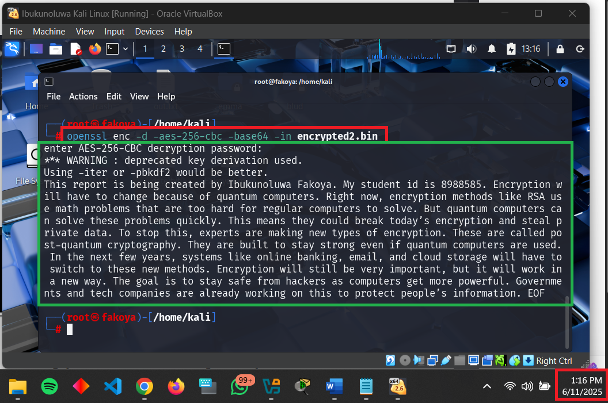
*Decryption process restoring original file content from encrypted format*

### 7. RC2 Cipher Encryption Implementation
- Encrypted file using deprecated RC2 algorithm with PBKDF2
- Applied Base64 encoding for consistent output format
- Generated encrypted output with weaker cryptographic algorithm

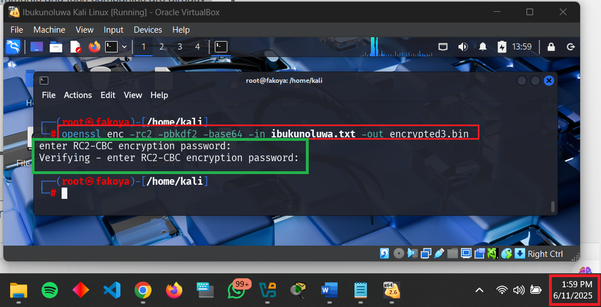
*RC2 cipher encryption process with PBKDF2 key derivation*

### 8. RC2 Encrypted Output Examination
- Displayed RC2-encrypted Base64 content
- Showed similar appearance to stronger encryption outputs
- Demonstrated visual indistinguishability between algorithms

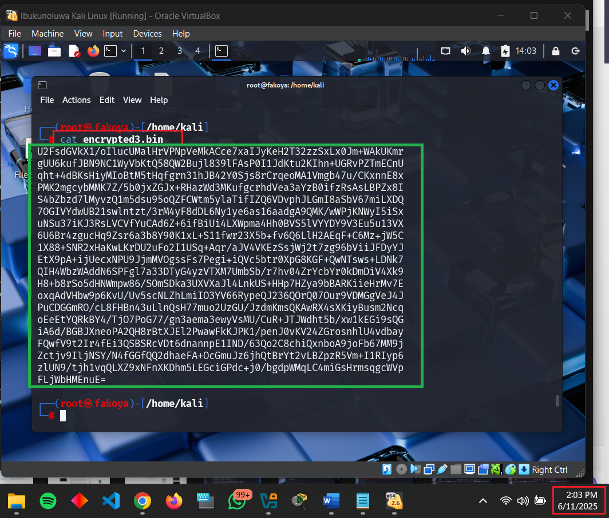
*RC2-encrypted file content in Base64 format*

### 9. Blowfish Cipher Encryption Implementation
- Encrypted file using Blowfish algorithm with PBKDF2
- Maintained Base64 encoding for comparison consistency
- Generated encrypted output with intermediate-strength algorithm

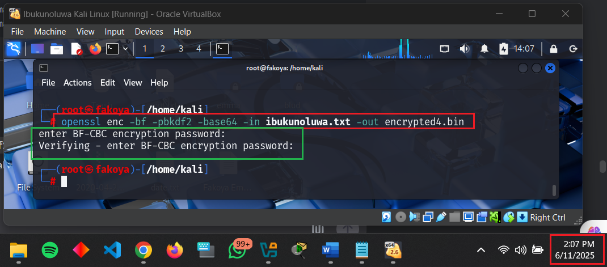
*Blowfish cipher encryption process with secure key derivation*

### 10. Blowfish Encrypted Output Examination
- Displayed Blowfish-encrypted Base64 content
- Showed algorithm-specific encrypted output patterns
- Demonstrated visual encryption characteristics

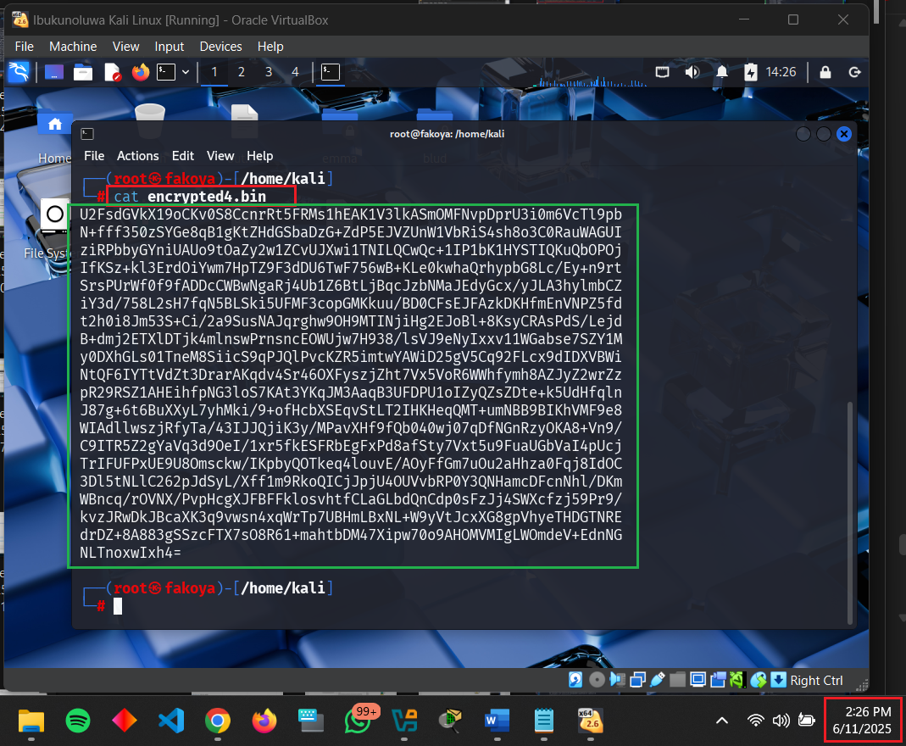
*Blowfish-encrypted file content in Base64 format*

### 11. RC2 Decryption Verification
- Successfully decrypted RC2-encrypted file
- Verified algorithm functionality despite deprecation
- Confirmed data integrity through decryption process

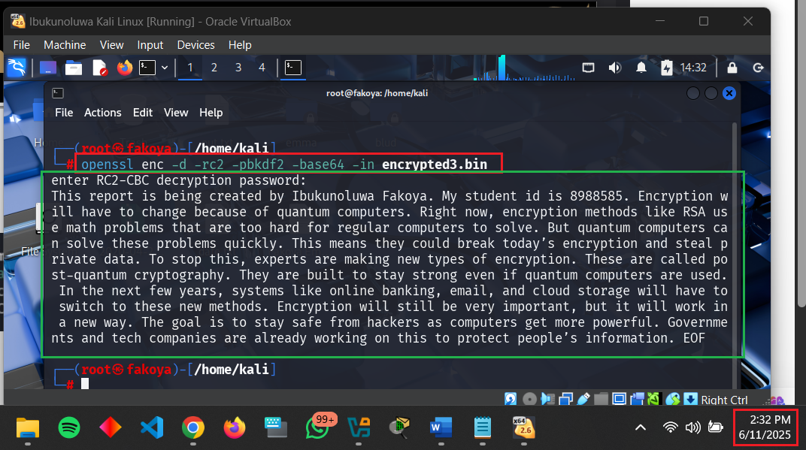
*RC2 cipher decryption restoring original content*

### 12. Blowfish Decryption Verification
- Successfully decrypted Blowfish-encrypted file
- Verified algorithm functionality and compatibility
- Confirmed symmetric encryption consistency

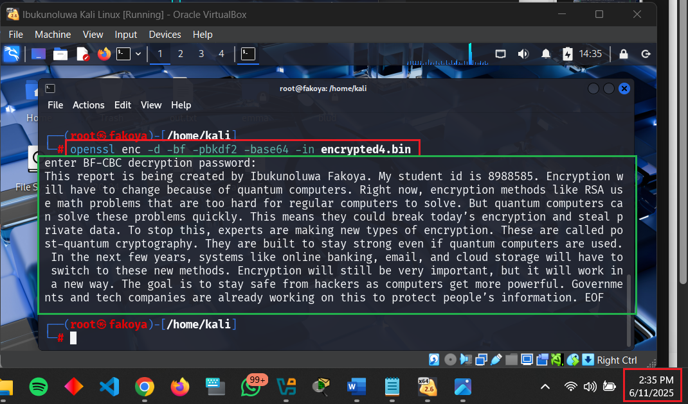
*Blowfish cipher decryption process showing successful restoration*

---

## Observations and Challenges

### Technical Implementation Challenges
- **Key Derivation Warnings**: OpenSSL deprecated legacy key derivation methods requiring PBKDF2 implementation
- **Algorithm Compatibility**: Different ciphers required specific parameters and compatibility testing
- **Encoding Considerations**: Binary vs Base64 output required different handling and storage approaches

---

## Reflections

### Cryptographic Principles Demonstrated
- **Symmetric Encryption Efficiency**: All tested algorithms provided reversible encryption with single keys
- **Encoding Practicality**: Base64 enables encrypted data transmission through text-based protocols
- **Algorithm Evolution**: Clear security progression from RC2 to Blowfish to AES-256

### Security Best Practices
- **Key Derivation Importance**: PBKDF2 significantly enhances password-based encryption security
- **Algorithm Selection Criteria**: Need for continuous evaluation of cryptographic algorithm strength
- **Defense in Depth**: Encryption as one layer in comprehensive security strategy

---

## How to Reproduce

### Prerequisites
- Kali Linux or Ubuntu system with OpenSSL installed
- Administrative privileges for cryptographic operations
- Text file for encryption testing

### Implementation Steps


```bash
#Create Test File
nano ibukunoluwa.txt
cat ibukunoluwa.txt

#AES-256-CBC Encryption (Binary)
sudo su
openssl enc -aes-256-cbc -in ibukunoluwa.txt -out encrypted1.bin
cat encrypted1.bin

#AES-256-CBC Encryption (Base64)
openssl enc -aes-256-cbc -base64 -in ibukunoluwa.txt -out encrypted2.bin
cat encrypted2.bin

#AES-256-CBC Decryption
openssl enc -d -aes-256-cbc -base64 -in encrypted2.bin

#RC2 Encryption
openssl enc -rc2 -pbkdf2 -base64 -in ibukunoluwa.txt -out encrypted3.bin
cat encrypted3.bin

#Blowfish Encryption
openssl enc -bf -pbkdf2 -base64 -in ibukunoluwa.txt -out encrypted4.bin
cat encrypted4.bin

#RC2 Decryption
openssl enc -d -rc2 -pbkdf2 -base64 -in encrypted3.bin

#Blowfish Decryption
openssl enc -d -bf -pbkdf2 -base64 -in encrypted4.bin
